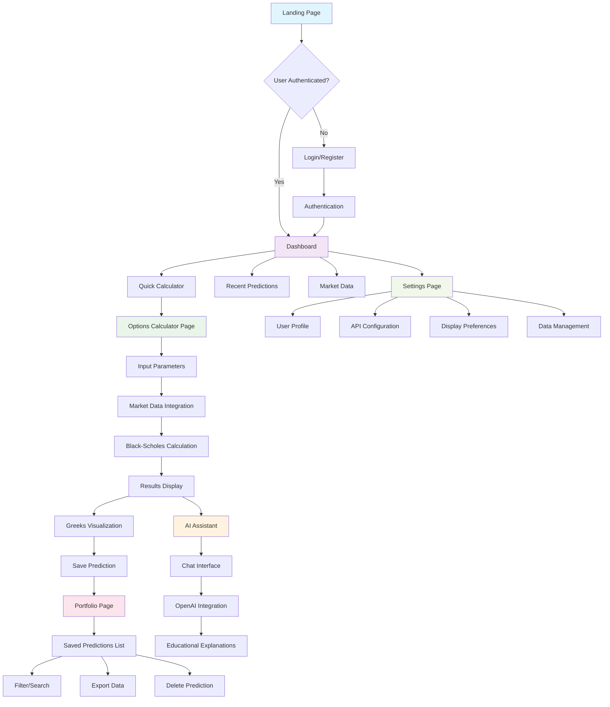
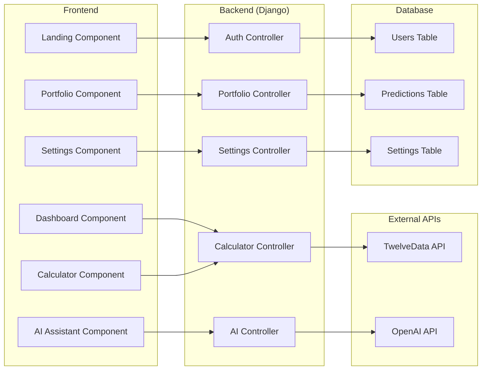

# FinanceBuddy Options Price Calculator - UI Flow Diagram

## User Interface Flow

## Component Architecture

## Key Features

### 1. **Authentication System**
- Secure login/registration
- Password reset functionality

### 2. **Options Calculator**
- Real-time market data integration
- Black-Scholes pricing model
- Greeks calculation
- Implied volatility calculation

### 3. **AI Assistant**
- OpenAI GPT integration
- Context-aware explanations
- Educational content
- Safety guardrails

### 4. **Portfolio Management**
- Save and organize predictions
- Export/import functionality
- Search and filter capabilities

## Technical Stack

### Frontend
- React with TypeScript
- Material-UI or Tailwind CSS
- Chart.js for visualization

### Backend
- Django with Python
- PostgreSQL database

### External Integrations
- TwelveData API for market data
- OpenAI API for explanations

