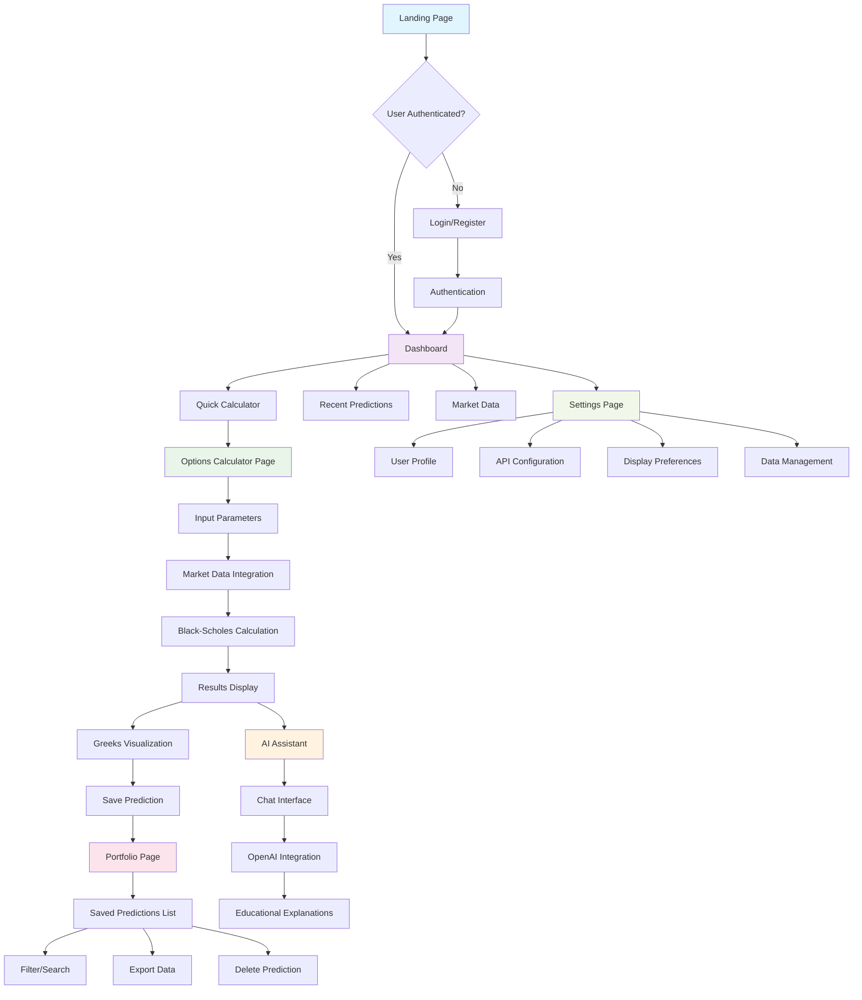
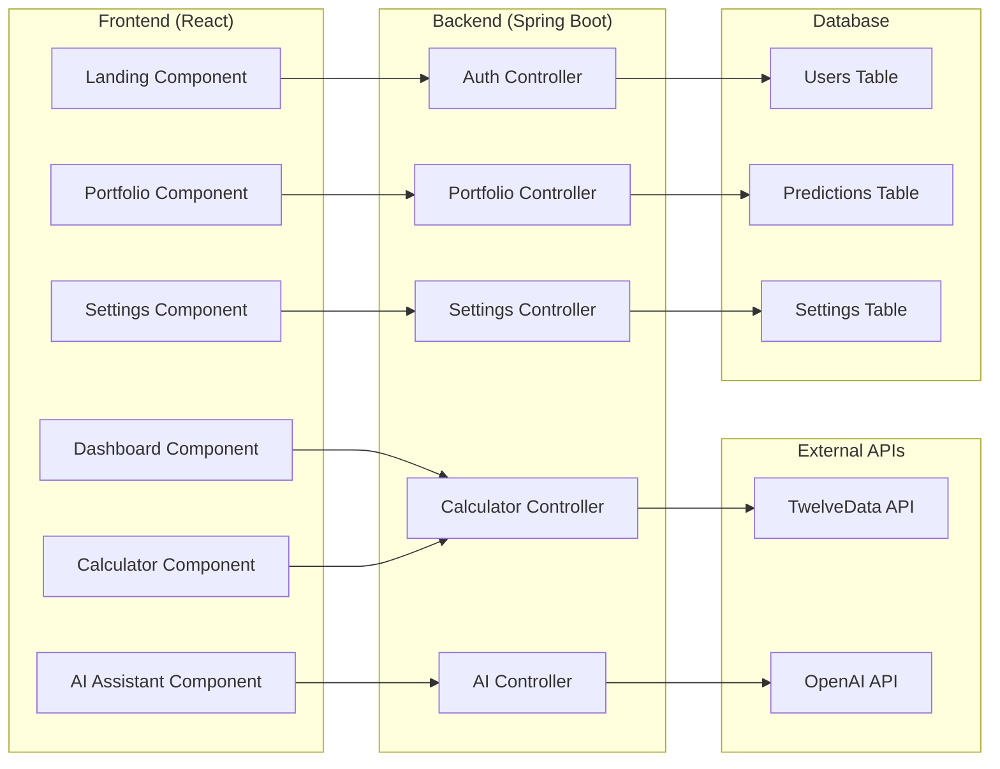

# FinanceBuddy Options Price Calculator - UI Flow Diagram

## User Interface Flow



## Component Architecture



## Screen Layouts

### Dashboard Layout
```
┌─────────────────────────────────────────────────────────────┐
│ 🏠 FinanceBuddy    [Dashboard] [Calculator] [Portfolio] [Settings] │
├─────────────────────────────────────────────────────────────┤
│ Welcome back, [User Name]!                                   │
│                                                             │
│ ┌─────────────────────────────────────────────────────────┐ │
│ │                QUICK CALCULATOR                         │ │
│ │                                                         │ │
│ │ Symbol: [AAPL____] [Get Market Data]                   │ │
│ │                                                         │ │
│ │ Spot: [189.45] Strike: [190.00] Time: [0.25] Vol: [0.25] │ │
│ │                                                         │ │
│ │ [Calculate] [Save] [Explain]                            │ │
│ └─────────────────────────────────────────────────────────┘ │
│                                                             │
│ ┌─────────────────────────────────────────────────────────┐ │
│ │                RECENT PREDICTIONS                      │ │
│ │                                                         │ │
│ │ AAPL Call 190.00  [View] [Delete]                       │ │
│ │ MSFT Put 300.00   [View] [Delete]                       │ │
│ └─────────────────────────────────────────────────────────┘ │
└─────────────────────────────────────────────────────────────┘
```

### Calculator Layout
```
┌─────────────────────────────────────────────────────────────┐
│ 🏠 FinanceBuddy    [Dashboard] [Calculator] [Portfolio] [Settings] │
├─────────────────────────────────────────────────────────────┤
│ ┌─────────────────────────────────────────────────────────┐ │
│ │                INPUT PARAMETERS                        │ │
│ │                                                         │ │
│ │ Symbol: [AAPL____] [Get Market Data] [Auto-fill]        │ │
│ │                                                         │ │
│ │ Spot: [189.45] Strike: [190.00] Time: [0.25] Vol: [0.25] │ │
│ │ Risk-Free: [0.0425] Dividend: [0.00] Type: [Call ▼]     │ │
│ │                                                         │ │
│ │ [Calculate] [Save] [Reset]                              │ │
│ └─────────────────────────────────────────────────────────┘ │
│                                                             │
│ ┌─────────────────────────────────────────────────────────┐ │
│ │                CALCULATION RESULTS                      │ │
│ │                                                         │ │
│ │ Price: $3.42    Delta: 0.57    Gamma: 0.041            │ │
│ │ Theta: -0.045   Vega: 0.13     Rho: 0.09               │ │
│ │                                                         │ │
│ │ [Save] [Export] [Explain with AI]                      │ │
│ └─────────────────────────────────────────────────────────┘ │
└─────────────────────────────────────────────────────────────┘
```

### AI Assistant Layout
```
┌─────────────────────────────────────────────────────────────┐
│ 🏠 FinanceBuddy    [Dashboard] [Calculator] [Portfolio] [Settings] │
├─────────────────────────────────────────────────────────────┤
│ ┌─────────────────────────────────────────────────────────┐ │
│ │                AI EXPLANATION ASSISTANT                │ │
│ │                                                         │ │
│ │ 🤖 AI: "This AAPL call option costs about $3.42.       │ │
│ │      Here's what that means:                            │ │
│ │                                                         │ │
│ │      • If AAPL goes up by $1, you'd gain about $0.57    │ │
│ │      • Each day that passes, you lose about $0.045     │ │
│ │      • If volatility increases, the option becomes      │ │
│ │        more valuable (Vega = 0.13)                     │ │
│ │                                                         │ │
│ │      This is educational information only, not          │ │
│ │      financial advice."                                 │ │
│ │                                                         │ │
│ │ [Type your question...] [Send]                         │ │
│ │                                                         │ │
│ │ [Clear Chat] [Export] [New Explanation]                │ │
│ └─────────────────────────────────────────────────────────┘ │
└─────────────────────────────────────────────────────────────┘
```

## Mobile Responsive Design

### Mobile Navigation
```
┌─────────────────────────────────────────────────────────────┐
│ ☰ FinanceBuddy                    [👤] [⚙️]              │
├─────────────────────────────────────────────────────────────┤
│                                                             │
│ ┌─────────────────────────────────────────────────────────┐ │
│ │                QUICK CALCULATOR                         │ │
│ │                                                         │ │
│ │ Symbol: [AAPL____] [Get Data]                           │ │
│ │                                                         │ │
│ │ Spot: [189.45]    Strike: [190.00]                     │ │
│ │ Time: [0.25]      Vol: [0.25]                          │ │
│ │                                                         │ │
│ │ [Calculate] [Save] [Explain]                            │ │
│ └─────────────────────────────────────────────────────────┘ │
│                                                             │
│ ┌─────────────────────────────────────────────────────────┐ │
│ │                RESULTS (Mobile Cards)                    │ │
│ │                                                         │ │
│ │ Price: $3.42    Delta: 0.57                             │ │
│ │ Gamma: 0.041    Theta: -0.045                           │ │
│ │                                                         │ │
│ │ [View Details] [Save] [Explain]                         │ │
│ └─────────────────────────────────────────────────────────┘ │
└─────────────────────────────────────────────────────────────┘
```

## Key Features

### 1. **Authentication System**
- Secure login/registration
- JWT token-based sessions
- Password reset functionality

### 2. **Options Calculator**
- Real-time market data integration
- Black-Scholes pricing model
- Greeks calculation
- Implied volatility calculation

### 3. **AI Assistant**
- OpenAI GPT integration
- Context-aware explanations
- Educational content
- Safety guardrails

### 4. **Portfolio Management**
- Save and organize predictions
- Export/import functionality
- Search and filter capabilities

### 5. **Responsive Design**
- Mobile-first approach
- Touch-friendly interfaces
- Progressive Web App capabilities

## Technical Stack

### Frontend
- React with TypeScript
- Material-UI or Tailwind CSS
- Chart.js for visualization
- Axios for API calls

### Backend
- Spring Boot with Java
- JWT authentication
- PostgreSQL database
- RESTful API endpoints

### External Integrations
- TwelveData API for market data
- OpenAI API for explanations
- Cloud hosting (AWS/Azure/GCP)
